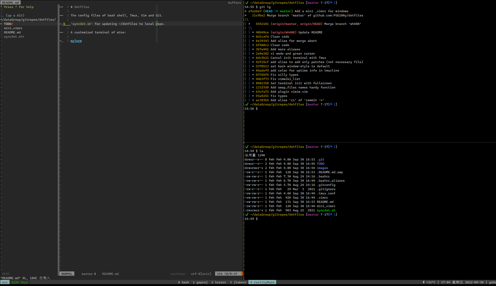
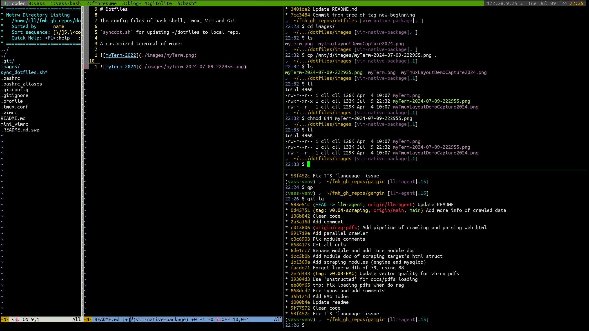

# My Dotfiles

GNU stow 管理的个人 dotfiles。目标：在新机器上快速恢复工作环境（工具 + 配置）。

## 新机器恢复

```bash
# 1. 基础工具
sudo apt install git stow

# 2. 克隆仓库
git clone git@github.com:FGG100y/dotfiles.git ~/dotfiles

# 3. 一键 bootstrap：apt + pipx + claude/opencode 安装 + stow 部署
cd ~/dotfiles && ./bootstrap.sh
#    可用 --dry-run 预览、--skip apt,pipx,... 跳阶段

# 4. vim pack 插件
./vim-packsync.sh        # 之后更新用 ./vim-packsync.sh --update

# 5. 手动收尾（bootstrap 结尾也会提醒）：
#    - gh auth login
#    - 密钥写入 ~/.bashrc.local / ~/.claude/settings.local.json（见下）
#    - tmux 内 prefix-I 装 tpm 插件；nvim 首次启动自动装 lazy 插件
```

## 日常更新

```bash
# home 里的点文件就是指向本仓库的符号链接，直接编辑后提交即可
vim ~/.vimrc && cd ~/dotfiles && git commit -am '...'

# 新增一个配置：放入对应包目录，再部署
mkdir -p ~/dotfiles/foo && cp ~/.config/foo.conf ~/dotfiles/foo/
cd ~/dotfiles && stow -t ~ foo && git add foo && git commit -m 'Add foo'
```

## 密钥放哪（绝不入库）

| 密钥 | 位置 |
|---|---|
| shell 环境变量（ANTHROPIC_AUTH_TOKEN、DEEPSEEK_API_KEY…） | `~/.bashrc.local`（.bashrc 末尾自动 source） |
| Claude Code 的 env（不经 shell 启动时） | `~/.claude/settings.local.json`（已被全局 gitignore） |

```bash
# ~/.bashrc.local
export ANTHROPIC_AUTH_TOKEN=sk-xxx
export DEEPSEEK_API_KEY=sk-xxx
```

```json
// ~/.claude/settings.local.json
{
  "env": {
    "ANTHROPIC_AUTH_TOKEN": "sk-xxx",
    "ANTHROPIC_BASE_URL": "https://api.deepseek.com/anthropic",
    "API_TIMEOUT_MS": "3000000"
  }
}
```

## 包布局

| 包 | 内容 |
|---|---|
| bash | .bashrc .bash_aliases .bash_aliases_local .profile .fzf.bash |
| vim | .vimrc .vimrc.basic（nvim 共用基础配置） .vim/pack/bundle/opt/google_python_style（无 git 的本地插件） |
| nvim | .config/nvim（lazy.nvim + lazy-lock.json 锁版本） |
| tmux | .tmux.conf .tmux/bin/{battery_status.sh,toggle-theme} |
| git | .gitconfig .config/git/ignore |
| claude | .claude/{settings.json,CLAUDE.md,skills/,hooks/,plugins/config.json} |
| opencode | .config/opencode/{opencode.json,AGENTS.md,oh-my-opencode.json,package.json,skills/} |
| gh | .config/gh/config.yml（hosts.yml 含 token，不入库） |
| vscode | .config/Code/User/{settings.json,keybindings.json} |
| cursor | .config/Cursor/User/settings.json |
| ideavim | .ideavimrc |
| fcitx5 | .config/fcitx5/{config,profile,conf/notifications.conf} |
| misc | .selected_editor .xinputrc |

```bash
# 全部部署（bootstrap.sh 会自动执行）
cd ~/dotfiles && stow -t "$HOME" bash vim nvim tmux git claude opencode gh vscode cursor ideavim fcitx5 misc
```

注意：**不要用 `stow *`** —— 根下的 README/scripts/packages/legacy/ 不属于任何包。

### stow 已知陷阱

- 首次部署时若 home 已有同名真实文件，stow 会报冲突。确认内容一致后 `rm` 原文件再 stow，或用 `stow --adopt`。
- **`--adopt` 会用 home 文件内容覆盖仓库文件**（再建链接），只在两者一致时安全。

## 本机差异

- `.bashrc` 的别名机制是"文件存在即 source"（`.bash_aliases` / `.bash_aliases_local`），无 hostname 逻辑；某台机器专属的东西放 `~/.bashrc.local`。
- `.bashrc` 中 node18 / pi-node / opencode / pyenv / JBR 等 PATH 是本机安装位置，新机器缺目录时无副作用（PATH 可含不存在的目录）。
- `~/.config/git/ignore` 全局忽略 `**/.claude/settings.local.json`。

## 自编译工具（不脚本化，见 bootstrap 提醒）

- **tmux**：`.tmux.conf` 需要 >=3.6（extended-keys / OSC52），22.04 的 apt 版只有 3.2a 会报 invalid option。自编译（本机装到 `~/.local/bin/tmux`）：

```bash
sudo apt install libevent-dev libncurses-dev bison pkg-config
curl -fsSL https://github.com/tmux/tmux/releases/download/3.7b/tmux-3.7b.tar.gz | tar xz
cd tmux-3.7b && ./configure && make && cp tmux ~/.local/bin/
```

- **nvim dev 版**：本机装在 `~/.local/bin/nvim`，按需从 release/源码获取。
- **YCM**：克隆后需编译 `cd ~/.vim/pack/vendor/start/YouCompleteMe && python3 install.py`。

## legacy/（参考，不部署）

- `legacy/windows/mini_vimrc` —— Windows 用 vim-plug 版配置
- `legacy/server/.bash_aliases_server` —— svr81 旧机器别名

## 历史

- 旧 `sync_dotfiles.sh`（rsync 单向同步）已移除，由 stow + bootstrap.sh 取代。
- 旧分支 `master` / `wh608` / `svr81` 保留作历史参考。

## 截图




